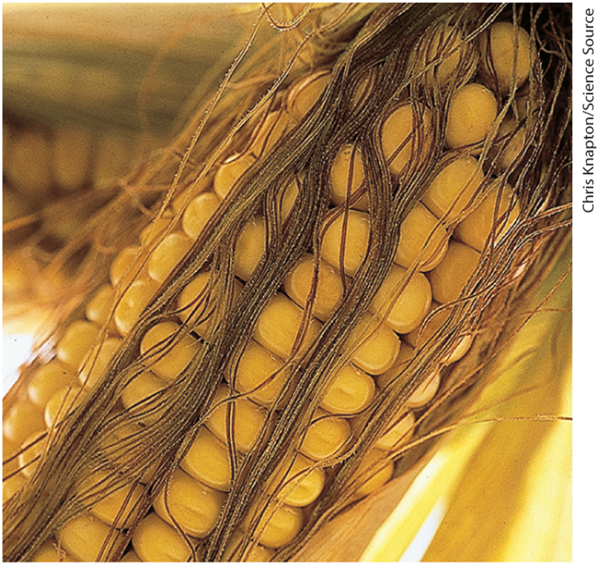
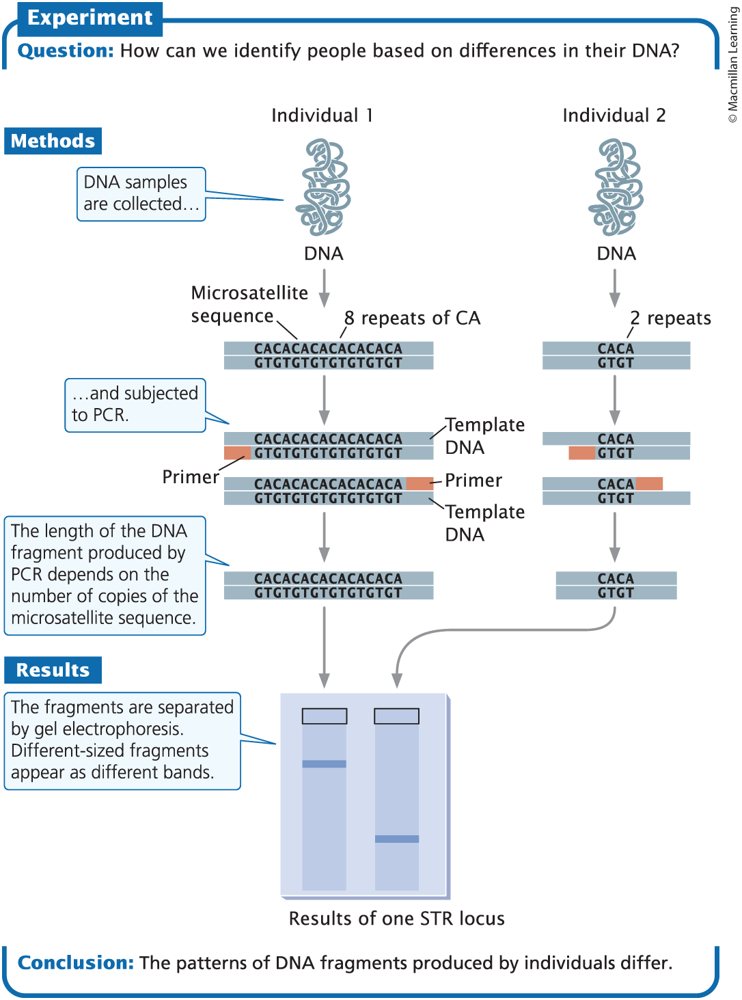
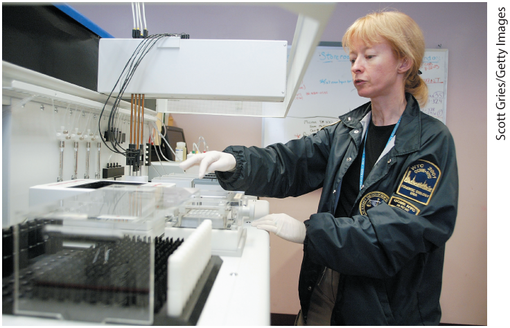
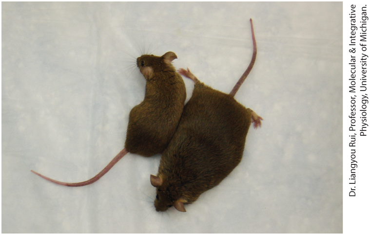
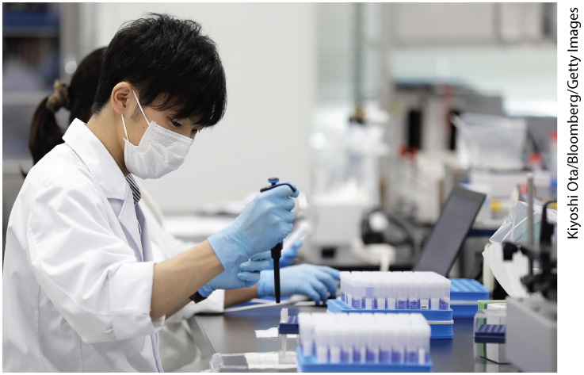

<!-- Slide number: 1 -->
# Molecular Genetic Analysis and Biotechnology
Lecture 31, 32
Ch. 14 (2025); Ch. 19 (2021)

<!-- Slide number: 2 -->
# Hutchinson-Gilford Syndrome, the Secret of Aging, and CRISPR-Cas

### Notes:
A child with Hutchinson-Gilford progeria syndrome, a condition that causes premature aging. Today researchers are exploring the use of CRISPR-Cas genome editing to correct the genetic mutation that causes this condition.

<!-- Slide number: 3 -->
# Genetics Has Been Transformed by the Development of Molecular Techniques
1. Recombinant DNA technology (genetic engineering)
2. Techniques for locating, isolating, altering, and studying DNA segments
3. Key innovations in molecular genetics
4. Recombinant DNA technology
5. The polymerase chain reaction
6. DNA sequencing technology
7. Genome editing methods
8. Working at the molecular level

<!-- Slide number: 4 -->
# Molecular genetic techniques have been used to create genetically modified crops.

### Notes:
Molecular genetic techniques have been used to create genetically modified crops. Genetically engineered corn now constitutes 93% of all corn grown in the United States.

<!-- Slide number: 5 -->
# Molecular Techniques Are Used to Cut, Visualize, and Recombine DNA Sequences
1. Recombinant DNA Technology
2. Restriction enzymes
3. Separating and Viewing DNA fragments
4. Locating DNA fragments with probes
5. Gene cloning

<!-- Slide number: 6 -->
# Recombinant DNA Technology
Techniques that can be used to analyze, alter, and recombine virtually any DNA sequences from any number of sources
Recombinant is used because frequently, the goal is to combine DNA from two or more distinct sources.
Commonly called genetic engineering

<!-- Slide number: 7 -->
# Restriction Enzymes
Enzymes that recognize specific nucleotide sequences in DNA and make double-stranded cuts at those sequences (called restriction sites).
Produced by bacteria to defend against viruses
Cohesive ends: fragments with short, single-stranded overhanging ends (also called sticky ends)
Blunt ends: even-length ends from both single strands

<!-- Slide number: 10 -->

# Characteristics of some common type II restriction enzymes used in recombinant DNA technology

| Enzyme  | Microorganism from Which Enzyme is Produced | Recognition Sequence              | Type of Fragment End Produced |
| ------- | ------------------------------------------- | --------------------------------- | ----------------------------- |
| BamHI   | Bacillus amyloliquefaciens                  | ↓ 5′ -GGATCC- 3′ 3′ -CCTAGG- 5′ ↑ | Cohesive                      |
| CofI    | Clostridium formicoaceticum                 | ↓ 5′ -GCGC- 3′ 3′ -CGCG- 5′ ↑     | Cohesive                      |
| EcoRI   | Escherichia coli                            | ↓ 5′ -GAATTC- 3′ 3′ -CTTAAG- 5′ ↑ | Cohesive                      |
| EcoRII  | Escherichia coli                            | ↓ 5′ -CCAGG- 3′ 3′ -GGTCC- 5′ ↑   | Cohesive                      |
| HaeIII  | Haemophilus aegyptius                       | ↓ 5′ -GGCC- 3′ 3′ -CCGG- 5′ ↑     | Blunt                         |
| HindIII | Haemophilus aegyptius                       | ↓ 5′ -AAGCTT- 3′ 3′ -TTCGAA- 5′ ↑ | Cohesive                      |
| PvuII   | Proteus vulgaris                            | ↓ 5′ -GAGCTG- 3′ 3′ -GTCGAC- 5′ ↑ | Blunt                         |
### Notes:
TABLE 19.1 Characteristics of some common type II restriction enzymes used in recombinant DNA technology

<!-- Slide number: 11 -->

# Restriction enzymes make double-stranded cuts in DNA, producing cohesive (sticky) ends.

![A two-part illustration labeled “a" and “b” shows the production of cohesive or sticky ends by restriction enzymes making double-stranded cut in D N A. Part “a” shows sticky ends produced by Hind 3 and blunt ends produced by P V U 2. Hind 3 acts on the D N A sequence as follows: strand 1-A (an arrow points between) A G C T T, strand 2-T T C G A (an arrow points between) A. This leads to a D N A sequence having a nick in the areas where arrows were present. A caption reads, “Some restriction enzymes, such as Hind 3, make staggered cuts in D N A, producing single-stranded, cohesive (sticky) ends.” P V U 2 acts on a D N A sequence as follows: strand 1-C A G (an arrow points between) C T G, strand 2-G T C (an arrow points between) G A C. This leads to a D N A sequence having a nick in the areas where arrows were present. The D N A fragments are labeled blunt ends. A caption reads, “Other restriction enzymes, such as P V U 2 cut both strands of D N A straight across, producing blunt ends.” Part “b” shows two different D N A molecules cut with the same restriction enzyme, Hind 3. A flowchart is shown. Initially, the flowchart has two branches having the same D N A sequence in two different colors. First branch shows the D N A sequence as follows: strand 1-A (an arrow points between) A G C T T, strand 2-T T C G A (an arrow points between) A in blue color. Second branch shows the same sequence in red. Both the D N A sequences are digested with Hind 3 producing nicks where arrows were present. A downward arrow then merges the two branches and is labeled “combine fragments”. A D N A sequence is then shown as follows: strand 1-A (blue) A G C T T (red), strand 2-T T C G A (blue) A (red). The places in the sequence where red and blue color merge are labeled nick in sugar-phosphate backbone. A caption reads, “D N A molecules cut with the same restriction enzyme have complementary sticky ends that pair if fragments are mixed together.” A downward arrow leads to the same D N A sequence having ligase bound to the places where nicks were present. A caption reads, “The nicks in the sugar–phosphate backbone of the two fragments can be sealed by D N A ligase.”](images/03.png)

### Notes:
Restriction enzymes make double-stranded cuts in DNA, producing cohesive, or sticky, ends.

<!-- Slide number: 16 -->

# CRISPR-Cas Genome Editing

Revolutionized the field of genetics
Powerful way to modify the genome
Works in many organisms from bacteria to humans

<!-- Slide number: 16 -->

# CRISPR-Cas immunity

How bacteria protects itself from phages, plasmids, other invading DNA elements
Bits of DNA from the invader are incorporated into the host genome ON PURPOSE within clustered regularly interspaced short palindromic repeats to provide a "memory" of the invader.
This array of DNA is transcribed, cleaved, loaded onto Cas proteins which have nuclease activity
If foreign DNA enters again the crRNA-Cas complex binds it, Cas9 cleaves it, and renders it nonfunctional.

<!-- Slide number: 16 -->

# CRISPR-Cas9

Heavily adopted by scientists
Naturally requires 2 RNAs crRNA and tracrRNA
Engineered by scientists into a single guide RNA (sgRNA)
20 nucleotide region of sgRNA can be altered to target any region in genome

<!-- Slide number: 16 -->

# PAM sequences

Target for cleavage needs to have a protospacer adjacent motif.
Short and weak consensus sequences, therefore common throughout the genome
The CRISPR-Cas9 complex first binds PAM and then Cas9 unwinds the DNA
sgRNA can then pair with complimentary sequence in the DNA
Then it is cleaved by Cas9 -- a double-stranded break

<!-- Slide number: 16 -->
# DNA repair after cleavage by Cas9
Two major DSB repair pathways:
1. nonhomologous end joining (2 ends joined without template)
	- Small insertions or deletions introduced at the target site which can cause frameshifts, etc.
2. homology directed repair
	- Researcher can provide donor dsDNA with sticky ends

![A flowchart shows C R I S P R-Cas 9 technique for precisely editing the genome. An R N A molecule containing a stem, also called single-guide R N A, binds to Cas 9 protein. A caption reads, “The single guide R N A and Cas 9 protein combine to form an effector complex which associates with the PAM sequence, unwinds the D N A, and pairs with the complementary sequence on the D N A.” The complex formed is called the effector complex. The left part of the single-guide R N A in the effector complex has a seed sequence. The effector complex binds to a target D N A strand near the PAM sequence, unwinds part of the D N A forming a bubble at the center, and cleaves the D N A into 2 double-stranded molecules. A caption reads, “The Cas protein cleaves the D N A.” The strands are repaired by either nonhomologous end joining, which can introduce duplications or deletions, or homologous recombination. In homology directed repair, a donor D N A molecule is inserted between the breaks. A caption reads, “Repair by nonhomologous end joining introduces duplications or deletions.” Another caption reads, “Repair by homology directed repair allows insertion of donor D N A.”](images/24.png)

<!-- Slide number: 16 -->

# Modifications to the CRISPR-Cas9 system
1. Prime editing (Cas9 + Reverse transcriptase, allows single base pair edits
2. TFs or chromatin-remodeling proteins can be tethered to inactivated Cas9 (guides but doesn't cut DNA)
3. Target a DNA polymerase that makes a lot of mistakes to a given location to help study evolution
4. ...

<!-- Slide number: 16 -->

# Limitations to CRISPR-Cas9

1. Off-target cleavage
2. Ethical implications of germline editing

<!-- Slide number: 16 -->
# Separating and Viewing DNA Fragments
Gel electrophoresis
Separates molecules based on size and electrical charge

<!-- Slide number: 17 -->
# Gel electrophoresis can be used to separate DNA molecules on the basis of their size and electrical charge.

![A three-part illustration shows the use of gel electrophoresis to separate D N A molecules on the basis of their size and electric charge. Part “a” shows an electrophoretic chamber with wells and gel. D N A sample is being uploaded into a well through a pipette. The upper side of the chamber holds negative charge and the bottom holds positive charge. A caption reads, “D N A samples containing fragments of different sizes are placed in wells in an agarose gel.” Another caption reads, “An electrical current is passed through the gel.” A downward arrow labeled completion of migration leads to part “b” in which the electrophoretic chamber shows bands in the gel. The leftmost well shows size standards. Large fragments and small fragments are labeled on the bands. A caption reads, “All D N A fragments move toward the positive pole; small fragments migrate faster than large fragments. After electrophoresis, fragments of different sizes have migrated different distances.” A downward arrow leads to part “c” which shows a photo of the bands formed during gel electrophoresis. A caption reads, “A dye specifi¬c for nucleic acids is added to the gel.” Another caption reads, “D N A fragments appear as bands on the gel.”](images/04.png)

### Notes:
Gel electrophoresis can be used to separate DNA molecules on the basis of their size and electrical charge.

<!-- Slide number: 22 -->
# Locating DNA Fragments with Probes (1 of 2)
 Probe: DNA or RNA with a base sequence complementary to a sequence in the gene of interest
Labeled probes are complementary to the sequence of interest and can be used to locate individual genes or sequences among DNA fragments separated by electrophoresis.

<!-- Slide number: 23 -->
# Locating DNA Fragments with Probes (2 of 2)
Southern blotting: used to transfer DNA fragments from a gel to a solid medium
Northern blotting: used to transfer RNA from a gel to a solid medium
Western blotting: used to transfer protein from a gel to a solid medium

<!-- Slide number: 28 -->
# Gene Cloning (1 of 3)
Gene cloning: amplifying a specific piece of DNA via a bacteria cell
Cloning vector: a replicating DNA molecule attached to a foreign DNA fragment to be introduced into a cell

<!-- Slide number: 29 -->
# Gene Cloning (2 of 3)
Plasmid vectors
Plasmids: circular DNA molecules from bacteria
Insert foreign DNA into plasmid using restriction enzymes
Linkers: synthetic DNA fragments containing restriction sites
Transformation
Screening cells for recombinant plasmids
Selectable markers used to confirm whether the cells have been transformed

<!-- Slide number: 30 -->
# An ideal cloning vector has an origin of replication, one or more selectable markers, and recognition sites for one or more restriction enzymes.

![A map of a vector, with its unique restriction enzyme cleavage sites, origin, and selectable marker is shown. The vector shows two concentric circles very close to one another. A short fragment on each circle shows Ori (origin of replication) on the top left of the vector. A large arc on the circles on the bottom right is labeled selectable marker. In between ori and selectable marker, various unique restriction enzyme cleavage sites are present. Their sequence from left to right is as follow: P S T 1, Bam H 1, Sal 1, Eco R 1, and Hind 3. Captions in the vector map are as follows: “First, a cloning vector must contain an origin of replication recognized in the host cell so that it is replicated along with the D N A that it carries. Second, it should carry selectable markers—traits that enable cells containing the vector to be selected or identi¬fied. Third, a cloning vector needs a single cleavage site for each of one or more restriction enzymes used.”](images/05.png)

### Notes:
An ideal cloning vector has an origin of replication, one or more selectable markers, and recognition sites for one or more restriction enzymes.

<!-- Slide number: 31 -->

# The pUC19 plasmid is a typical cloning vector.

![An illustration shows p U C 19 plasmid. The vector shows two concentric circles very close to one another. A large segment of the circles on the right is labeled Ori. A small segment on bottom left is labeled amp superscript R. Another small segment on top of the circles is labeled restriction sites. The sequence of sites from left to right is as follows: Eco R 1, Sac 1, K P N 1, X m a 1, S m a 1, Bam H 1, X b a 1, S a l 1, H i n c 2, A c c 2, B s p M 1, P s t 1, S p h 1, and Hind 3. Lac Z superscript positive is also labeled on the restriction sites arc.](images/06.png)

### Notes:
The pUC19 plasmid is a typical cloning vector. This artificially constructed plasmid contains a cluster of unique restriction sites, an origin of replication, and two selectable markers: an ampicillin-resistance gene and a lacZ gene.

<!-- Slide number: 32 -->

# A foreign DNA fragment can be inserted into a plasmid with the use of restriction enzymes.

![An illustration shows the insertion of a foreign D N A fragment into a plasmid with the use of restriction enzymes. The illustration shows a circular plasmid with Eco R 1 restriction site as follows: first strand, G (an arrow points between) A A T T C; second strand C T T A A (an arrow points between) G. A linear double-stranded foreign D N A has the sequence, G (an arrow points between) A A T T C on the upper strand and C T T A A (an arrow points between) G on the lower strand on two sides. A caption reads, “The plasmid and the foreign D N A are cut by the same restriction enzyme—in this case, Eco R 1.” Complementary sticky ends are produced in the plasmid and the foreign D N A. The plasmid has the following sequence on one side: first strand, G; second strand, C T T A A and on the other side the sequence is as follows: first strand, A A T T C; second strand, G. The foreign D N A has the sequence A A T T C on one side and G on the other side of first strand and G on one side and C T T A A on the other side of the second strand. Another caption reads, “When mixed, the sticky ends anneal, joining the foreign D N A and plasmid.” The complementary sticky ends are joined together and show a plasmid having the sequence G A A T T C on first strand and C T T A A G on second strand on two positions. D N A ligase is joined to the nicks on the plasmid. Another caption reads, “Nicks in the sugar–phosphate bonds are sealed by D N A ligase.”](images/07.png)

### Notes:
A foreign DNA fragment can be inserted into a plasmid with the use of restriction enzymes.

<!-- Slide number: 33 -->

# The lacZ gene can be used to screen for bacteria containing recombinant plasmids.

![An illustration shows that the lac Z gene can be used to screen for bacteria containing recombinant plasmids. The illustration shows an intact circular plasmid (amp superscript R lac Z superscript positive) having a restriction site near the partial lac Z superscript positive gene. It is then cleaved on the restriction site and a complementary foreign D N A inserts in it, which is labeled recombinant plasmid (amp superscript R lac Z superscript positive). A caption reads, “Foreign D N A is inserted into the partial lac Z gene.” This is transferred into a conical flask containing bacteria. A caption reads, “Bacteria that are lac Z superscript negative are transformed by the plasmid.” The bacteria are then plated on medium with ampicillin and X-gal. A photo of bacterial culture with blue and white colonies in a petri dish is shown. The captions read as follows: Bacteria with an original (nonrecombinant) plasmid produce beta-galactosidase, which cleaves X-gal and makes the colonies blue. Bacteria with a recombinant plasmid do not synthesize beta-galactosidase. Their colonies remain white. Bacteria without a plasmid will not grow. Conclusion states that a white colony consists of bacteria carrying a recombinant plasmid.](images/08.png)

### Notes:
The lacZ gene can be used to screen for bacteria containing recombinant plasmids. An artificially constructed plasmid carries a fragment of the lacZ gene and an ampicillin-resistance gene. [Photograph courtesy of Edvotek.]

<!-- Slide number: 34 -->
# Gene Cloning (3 of 3)
Other gene vectors
Cosmids
Bacterial artificial chromosomes (BACs)
Yeast artificial chromosomes (YAC)
Ti plasmids

<!-- Slide number: 35 -->
# TABLE 19.2 Comparison of plasmids, phage λ, cosmids, and bacterial artificial chromosomes as cloning vectors
| Cloning Vector | Size of DNA That Can Be Cloned | Method of Propagation | Introduction to Bacteria |
| --- | --- | --- | --- |
| Plasmid | As large as 15 kb | Plasmid replication | Transformation |
| Phage λ | As large as 23 kb | Phage reproduction | Phage infection |
| Cosmid | As large as 44 kb | Plasmid reproduction | Phage infection |
| Bacterial artificial chromosome | As large as 300 kb | Plasmid reproduction | Electroporation |
Note: 1 kb = 1000 bp. Electroporation is the use of electrical pulses to increase the permeability of a membrane.

<!-- Slide number: 36 -->
# To ensure transcription and translation, a foreign gene may be inserted into an expression vector—in this example, an E. coli expression vector.

![An illustration shows various regions of an E coli expression vector. The vector shows two concentric circles very close to one another. Ori (origin of replication) is labeled on the bottom center of the vector. A large arc on the circles on center right is labeled selectable marker, such as antibiotic resistance. On the bottom left, it shows a region with genes encoding repressor that binds O and regulates P. In between these genes and selectable marker, various sites are labeled. Their sequence from left to right is as follow: bacterial promoter sequences (P), operator (O), transcription initiation sequences, multiple restriction sites, and the transcription-termination sequence. Captions in the illustration read as follows: “Expression vectors contain operon sequences that allow inserted D N A to be transcribed and translated. They also include sequences that regulate—turn on or turn off—the desired gene.”](images/09.png)

### Notes:
19.8 To ensure transcription and translation, a foreign gene may be inserted into an expression vector. In this example, an E. coli expression vector has been used.

<!-- Slide number: 51 -->
# 19.3 Specific DNA Fragments Can Be Amplified
The polymerase chain reaction
An enzymatic, in vitro method for rapidly amplifying DNA.
DNA is heated to separate the two strands.
Short primers attach to the target DNA.
DNA polymerase synthesizes new DNA strands from the primers.
Each cycle of PCR doubles the amount of DNA.
PCR has a number of important applications in molecular biology.

<!-- Slide number: 52 -->

# The Gibson assembly is a PCR-based alternative to restriction cloning.

![An illustration shows how multiple fragments can be cloned in a single step using the Gibson assembly. A circular cloning vector is present that has been cut with a restriction enzyme to produce sticky ends at the top. Two pieces of D N A are present above each having sticky ends. One of these pieces of D N A has a tan sticky end complementary to the left-hand sticky end of the vector and the other has an orange sticky end complementary to the right-hand sticky end of the cloning vector. Each fragment has an additional green sticky end facing the center that is complementary to the other fragment. These complementary ends are highlighted. A callout pointing to the matching left-hand sticky ends reads, 1 P C R is used to create regions of homology between D N A fragments and with the cloning vector. An arrow points down to show four horizontal fragments of D N A. The first and second of these fragments share the tan left-hand sticky end, the second and third fragments share the green sticky ends, and the third and fourth fragments share the orange right-hand sticky end. The sticky ends face each other to form potential overlap between the first and second fragments, the second and third fragments, and the third and fourth fragments. An arrow labeled nuclease points downward accompanied by a callout reading, 2 An exonuclease enzyme is used to remove nucleotides at 5 prime ends, creating 3 prime overhangs. The fragments are labeled to show that fragment 1 (the left-hand fragment) has a tan sticky end on its upper strand that ends at its 3 prime end; fragment 2 has a lower strand with a tan fragment that extends left to a 5 prime end. Fragment 4 (the right-hand fragment) has an upper strand with a 5 prime left end that does not have a sticky end and a lower strand with a 3 prime left end that has an orange sticky end. An arrow points down accompanied by a callout that reads, 3 Because they are homologous, the ends of the fragments will pair. The product now has an overlap between each pair of fragments. An arrow labeled D N A polymerase points down accompanied by a callout that reads, 4 D N A polymerase is used to fill in missing nucleotides. This yields a continuous strand of D N A that has coiled regions adjacent to each sticky end to show where D N A has been added. An arrow labeled D N A ligase points down accompanied by a callout reading, 5 D N A ligase seals the gaps in the sugar-phosphate linkages. This produces a single D N A molecule with highlighted regions showing where sticky ends have bound together. From left to right, the highlighted regions are tan, green, and orange.](images/12.png)

### Notes
The Gibson assembly is a PCR-based alternative to restriction cloning. It allows multiple fragments to be cloned in a single step

<!-- Slide number: 53 -->
# The polymerase chain reaction can be used to amplify even very small samples of DNA.

![A horizontal flowchart shows a double-stranded D N A fragment amplified into 8 identical fragments using polymerase chain reaction. The flowchart starts with a double stranded D N A with 5 prime and 3 prime labeled on both strands. The two strands separate and short primers are attached to their inner ends. A new D N A forms on both strands. The cycle repeats and produces eight D N A. Two D N A have one old D N A and one newly synthesized strand. The rest have both new strands. The captions in the illustration read, “first, D N A is heated to 90 to 100 degree Celsius to separate the two strands. Second, The D N A is quickly cooled to 30 to 65 degrees Celsius to allow short single-stranded primers to anneal to their complementary sequences. Third, the solution is heated to 72 degrees Celsius; D N A polymerase synthesizes new D N A strands, creating two new, double-stranded D N A molecules. Fourth, the entire cycle is repeated. Each time the cycle is repeated, the amount of target D N A doubles.”](images/13.png)

### Notes
The polymerase chain reaction can be used to amplify even very small samples of DNA.

<!-- Slide number: 54 -->
# Amplifying DNA Fragments with the Polymerase Chain Reaction (PCR)
Applications of PCR
Real-time PCR: quantitatively determines the amount of DNA amplified as the reaction proceeds

<!-- Slide number: 61 -->
# DNA Sequences Can Be Determined and Analyzed
Dideoxy sequencing
Next-Generation and Third-Generation Sequencing Technologies
DNA fingerprinting

### Notes:

<!-- Slide number: 62 -->
# Dideoxy Sequencing
Sanger’s dideoxy sequencing method
Dideoxyribonucleoside triphosphate (ddNTP) lacks a 3′-OH group, which terminates DNA synthesis

<!-- Slide number: 63 -->
# The dideoxy sequencing reaction requires a special substrate for DNA synthesis.
Structure of deoxyribonucleoside triphosphate, the normal substrate for DNA synthesis.
Structure of dideoxyribonucleoside triphosphate, which lacks an OH group on the 3′-carbon atom.

![Two diagrams labeled “a” and “b” shows the structure of deoxyribonucleoside triphosphate (d N T P) and dideoxyribonucleoside triphosphate (d d N T P), respectively. Diagram “a” shows the structure of deoxyribonucleoside triphosphate (d N T P). It shows a base attached to a pentose deoxyribose sugar. The chemical structure of pentose sugar is as follows: O attached to base, C H, C H 2, C H O H, C H 2 C H. From the carbon of C H 2 C H, three phosphate groups are attached in series, single bonded to each other. The P of these phosphate groups are labeled, alpha, beta, and gamma respectively as they move away from the C of C H 2 C H. The chemical structure of phosphate group is as follows: P is at the center. Four oxygen atoms are attached to it; one through double bond and three through single bonds. One of the single bonded O atoms has a negative charge. Diagram “b” shows the structure of dideoxyribonucleoside triphosphate (d d N T P). It is similar to d N T P, except it has H rather than O H in the pentose sugar.](images/14.png)

### Notes:
The dideoxy sequencing reaction requires a special substrate for DNA synthesis. (a) Structure of deoxyribonucleoside triphosphate, the normal substrate for DNA synthesis. (b) Structure of dideoxyribonucleoside triphosphate, which lacks an OH group on the 3′-carbon atom.

<!-- Slide number: 64 -->
# The dideoxy method is based on the termination of DNA synthesis.

![An illustration shows the dideoxy method of D N A sequencing. The illustration shows a template strand with sequence: 3 prime-C T A A G C T C G A C T-5 prime attached to a primer with O H at the 3-prime end. d N T P’s plus D N A polymerase are added with the template and primer in a test tube. From this test tube, four separate test tubes branch. One has d d A T P, one has d d C T P, one has d d G T P, and one has d d T T P. These lead to four different sequences with the template strand as follows: Test tube with d d A T P shows four strands as follows: 1, template; 2, G A T T C G A G C T G A; 3, G A T T C G A; 4, G A. Test tube with d d C T P shows three strands as follows: 1, template; 2, G A T T C G A G C; 3, G A T T C. Test tube with d d G T P shows five strands as follows: 1, template; 2, G A T T C G A G C T G; 3, G A T T C G A G; 4, G A T T C G; 5, G. Test tube with d d T T P shows four strands as follows: 1, template; 2, G A T T C G A G C T; 3, G A T T; 4, G A T. All these strands lead to a sequence of bands formed on gel electrophoresis. The heading reads, “A, C, G, and T”. The right vertical axis of the band sequence shows the sequence of complementary strand followed by the sequence of original template strand. The bands are shown from top to bottom as follows: A G T C G A G C T T A G. The captions in the illustration read as follows: “Each of four reactions contains: single-stranded target D N A to be sequenced, a primer, all four deoxyribonucleoside triphosphates, D N A polymerase, and one type of dideoxyribonucleoside triphosphate (d d N T P). Nucleotides are added to the 3 prime end of the primer, with the target D N A being used as a template. When a d d N T P is incorporated into the growing chain, synthesis terminates because the d d N T P lacks a 3 prime-O H group. Synthesis terminates at different positions on different strands, which generates a set of D N A fragments of various lengths, each ending in a d d N T P with the same base. The fragments produced in each reaction are separated by gel electrophoresis. The sequence can be read directly from the visualized bands, starting from the bottom. The sequence obtained is the complement of the original template strand.”](images/15.png)

### Notes:
The dideoxy method of DNA sequencing is based on the termination of DNA synthesis.
Each of four reactions contains: single-stranded target DNA to be sequenced, a primer, all four deoxyribonucleoside triphosphates, DNA polymerase, and one type of dideoxyribonucleoside triphosphate (ddNTP). Nucleotides are added to the 3’ end of the primer, with the target DNA being used as a template.
When a ddNTP is incorporated into the growing chain, synthesis terminates because the ddNTP lacks a 3 prime-OH group. Synthesis terminates at different positions on different strands, which generates a set of DNA fragments of various lengths, each ending in a ddNTP with the same base. The fragments produced in each reaction are separated by gel electrophoresis. The sequence can be read directly from the visualized bands, starting from the bottom. The sequence obtained is the complement of the original template strand.

<!-- Slide number: 65 -->

# The dideoxy sequencing method can be automated.

![An illustration shows the process of automation of the dideoxy-sequencing method. The illustration starts with a template strand with sequence: 5 prime-C C T A T T A T G A C A C A A C C G C A-3 prime. A caption reads, “A single-stranded D N A fragment whose base sequence is to be determined (the template) is isolated.” Four d d N T P’s namely; d d C T P, d d G T P, d d T T P, and d d A T P are added for each nucleotide in a test tube with d N T P’s. A caption reads, “Each of the four d d N T P’s is tagged with a different ¬fluorescent dye, and the dideoxy-sequencing reaction is carried out.” It leads to the template strand with the same sequence attached to a known primer sequence as follows: 3 prime-G C G T-5 prime. Then, a complementary strand forms. A caption reads, “The fragments that end in the same base have the same colored dye attached.” Then, the last nucleotide of the complementary strand, that is G, is eliminated from the strand. Electrophoretic bands are shown next with the use of laser. The sequence obtained is G G A T A A T A C T G T G T T G T C G T. The left side is labeled longest fragment with G G highlighted. The right side is labeled shortest fragment. A caption reads, “The products are denatured, and the D N A fragments produced by the reaction are loaded into a single well on an electrophoresis gel. The fragments migrate through the gel according to size, and the fluorescent dye on the D N A is detected by a laser beam.” A detector is then used to produce digital a graph with the help of laser. Two captions read as follows: “Each fragment appears as a peak on the computer printout; the color of the peak indicates which base is present. The sequence information is read directly into the computer.” The computer produced graph shows the following sequence: 3 prime-G G A T A A T A C T G T G T T G T C G T-5 prime.](images/16.png)

### Notes:
The dideoxy sequencing method can be automated.

<!-- Slide number: 72 -->
# Next-Generation Sequencing Technologies
Illumina sequencing
Third-generation sequencing technologies
These methods:
Sequence many DNA fragments simultaneously
Provide a much faster and less expensive determination of a DNA base sequence

<!-- Slide number: 73 -->
# Illumina sequencing is a next-generation sequencing technology.

![An illustration shows illumina sequencing. The illustration shows a template strand as follows: 3 prime-T T A G A C C G T A C A G-5 prime. A prime is attached with the following sequence: 5 prime-A A T C T-3 prime. d N T P’s are added with fluorescent tag, reversible terminator, and nucleoside triphosphate. First d T T P is added. The tag is excited while imaging. Then, it shows a continuous sequence of primer with the d T T P added. The same process continues with d G T P and the cycle repeats. The captions in the illustration read as follows: “Primers, D N A polymerase, and d N T P’s are added to the ¬flow cell. The primer attaches to the template. The first nucleotide is incorporated into the new strand. The tag is excited with a laser and fl¬uoresces. The fl¬uorescence is recorded by a computer. Thousands of fragments are sequenced and imaged simultaneously. The tag and terminator are removed. New d N T P’s and polymerase are added. The next nucleotide is incorporated and excited with a laser.”](images/17.png)

### Notes:
Illumina sequencing is a next-generation sequencing technology.

<!-- Slide number: 74 -->

![An illustration shows the steps of Pac Bio sequencing. A small horizontal double-stranded D N A fragment is shown at the top. An arrow points down and a curved line shows that Adaptors are added. This produces a D N A fragment with circular adaptors attached at each end. Each adaptor binds to the ends of the upper and lower strand with its central region extending outward to form a circle. Below, a Single Z M W sequencing chamber is shown. A disk-shaped D N A polymerase is at the bottom on either side of a highlighted region to which a red circle is being added. A callout pointing to the red circle reads, A d N T P is being added to the growing strand. A loop representing the Template strand extends up from this bottom D N A polymerase. There is also a vertical strand of Newly synthesized D N A extending up from the center of the D N A polymerase in the open region of the loop. There is a highlighted region at the top center of the loop of template strand. There are three circles on each side of the template strand, and these represent d N T Ps with fluorescent labels. An arrow points down to show a similar structure in which the red circle representing a d N T P is being added to the base of the growing strand and a zigzag of red extends upward from the base of the strand. A callout pointing to this zigzag reads, The d N T P emits a pulse of light just before being added.](images/18.png)
# In PacBio sequencing, fluorescent nucleotides emit pulses of colored light as they are added sequentially to a circularized DNA fragment.

### Notes:
In PacBio sequencing, fluorescent nucleotides emit pulses of colored light as they are added sequentially to a circularized DNA fragment.

<!-- Slide number: 75 -->

![An illustration shows how nanopore sequencing can be used to read the sequences of a D N A strand. A double-stranded piece of D N A at the top separates midway across and its lower strand bends down into the opening in a Nanopore below. The D N A strand extends through a red sphere in the opening of the top of the nanopore to continue down past a wider, diamond-shaped opening and into a narrow, tubular region. A callout pointing to the nanopore reads, As the D N A passes through the nanopore ellipses. An arrow points down to show a graph with time on the horizontal axis and current intensity on the vertical axis. A callout pointing to the graph reads, ellipses it disrupts an electrical current in the membrane. The graph shows a curve that forms a series of rectangular peaks and inverse peaks. The graph has a blocky appearance without curves. An arrow points down to a D N A sequence of A T C G T A G C A. A callout pointing to this sequence reads, A computer reads the change in current as the base sequence.](images/19.png)
# Nanopore sequencing reads the nucleotides of a DNA strand as they pass through a nanopore in a membrane.

### Notes:
Nanopore sequencing reads the nucleotides of a DNA strand as they pass through a nanopore in a membrane.

<!-- Slide number: 76 -->
# Characteristics of Illumina, PacBio, and nanopore sequencing technology
| Method | Average Read Length | (bp) Accuracy (%) | Estimated cost per kb (dollars) |
| --- | --- | --- | --- |
| Illumina | 50-250 | >99.9 | $0.01-0.03 |
| PacBio (HiFi) | 10,000-20,000 | >99 | $0.04-0.09 |
| Nanopore | 10,000-60,000 | 87-98 | $0.02-0.04 |
Data from G. A. Logsdon, M. R. Vollger, and E. E. Eichler, Long-read human genome sequencing and its applications, Nature Review Genetics 21:597–614, 2020.
### Notes:
Characteristics of Illumina, PacBio, and nanopore sequencing technology

<!-- Slide number: 77 -->
# DNA Fingerprinting (DNA Profiling)
Microsatellites: short tandem repeats (STRs), variable number of copies of repeat sequences possessed by many organisms
Detected by PCR
Fragments represented as peaks on a graph
Homozygotes: single tall peak
Heterozygotes: two shorter peaks

<!-- Slide number: 78 -->
# DNA fingerprinting can be used to identify people.

### Notes:
DNA fingerprinting can be used to identify people.

<!-- Slide number: 81 -->

# DNA fingerprinting can be used to determine the presence of a suspect at a crime scene.

![Three graphs show D N A profiles of suspect 1, suspect 2, and the individual from the crime scene, respectively. The horizontal axis of each D N A profile represents S T R fragment size in base pairs between base pair lengths 100 and 350, while the vertical axis reads fluorescence. The three profiles show S T R locus for D 8 S 1179, D 21 S 11, D 7 S 820, and C S F 1 P O. Suspect 1 shows two peaks for D 8 S 1179 at 8 and 12, one peak for D 21 S 11 at 25, two peaks for D 7 S 820 at 6 and 8, and two peaks for C S F 1 P O at 8 and 13. Suspect 2 shows one peak for D 8 S 1179 at 11, two peaks for D 21 S 11 at 30 and 32, two peaks for D 7 S 820 at 12 and 15, and one peak for C S F 1 P O at 15. Sample from crime scene shows one peak for D 8 S 1179 at 11, two peaks for D 21 S 11 at 30 and 32, two peaks for D 7 S 820 at 12 and 15, and one peak for C S F 1 P O at 15.](images/22.png)

### Notes:
DNA fingerprinting can be used to determine the presence of a suspect at a crime scene. The DNA profile of suspect 2 matches that of DNA evidence collected at the crime scene. Shown here are results from four STR loci.

<!-- Slide number: 86 -->
# Application: Identifying People Who Died in the Collapse of the World Trade Center
Usual means of victim ID were of little use with WTC remains
Used DNA fingerprinting
Also carried out on mitochondrial DNA

### Notes:
DNA fingerprinting was used to identify the remains of people who died in the collapse of the World Trade Center. The New York City Office of Chief Medical Examiner used automated DNA fingerprinting to match DNA from human remains recovered from the World Trade Center with DNA extracted from reference samples, such as blood samples and toothbrushes, of possible victims.

<!-- Slide number: 87 -->

# Molecular Techniques Are Increasingly Used to Analyze and Control Gene Function
Forward and reverse genetics
Creating random and targeted mutations
Transgenic animals
Knockout mice
Silencing genes with RNAi
RNA therapy

<!-- Slide number: 94 -->
# Forward and Reverse Genetics
Forward genetics: begins with a phenotype to a gene that encodes the phenotype
Reverse genetics: begins with a gene of unknown function, first inducing mutations and then checking the effect of the mutation on the phenotype

<!-- Slide number: 95 -->
# Creating Random and Targeted Mutations
Mutagens are environmental factors that increase rate of mutation (Section 18.2)
Provided a means of increasing the number of mutants in experimental populations of organisms.
Use of mutagenic agents: radiation, chemical mutagens, transposable elements
Mutations are induced at specific locations through a process called targeted mutagenesis.
CRISPR-Cas9 systems (see Section 19.5) are also used to create mutations at specific sites.

<!-- Slide number: 102 -->
# Transgenic Animals
An organism permanently altered by the addition of a DNA sequence to its genome

<!-- Slide number: 103 -->
# The genome of a transgenic organism has been permanently altered by genetic engineering.

### Notes:
The genome of a transgenic organism has been permanently altered by genetic engineering. The mouse on the right is transgenic for a mutation that causes obesity. [Dr. Liangyou Rui, Professor, Molecular & Integrative Physiology, University of Michigan.]

<!-- Slide number: 104 -->

# Transgenic animals have genomes that have been permanently altered through recombinant DNA technology.

![An illustration describes how to create transgenic mice and determine the ones with the desired sequence, so they can be selected and further propagated. The illustration starts with a cross between a male and a female mouse, which leads to a fertilized egg having two pronuclei. A caption reads, “Mice are mated, and fertilized eggs are removed from the female mouse. Foreign D N A is injected into one of the pronuclei.” An injecting needle is used to inject the gene of interest into one pronucleus. A suction pipette is shown on one end of the egg. A caption reads, “Embryos are implanted in a pseudopregnant female.” This egg gives rise to a mouse, which further produces six offspring labeled “a” through “f”. A caption reads, “Offspring are tested for the presence of the introduced transgene.” Bands are shown for all these offspring through gel electrophoresis. One female and one male mouse are crossed again; one of them is labeled “a”, which further gives rise to a mouse. A caption reads, “Mice carrying the gene are bred to produce a strain of mice with the foreign gene.”](images/27.png)

### Notes:
Transgenic animals have genomes that have been permanently altered through recombinant DNA technology. In the photograph, a mouse embryo is being injected with DNA. After injection, the embryos are implanted in a pseudopregnant female: a surrogate mother that has been physiologically prepared for pregnancy by mating with a vasectomized male. [Chad Baker/Thomas Northcut /Getty Images]

<!-- Slide number: 105 -->
# Knockout Mice
A normal gene of the mouse has been fully disabled.
Knock-in mice: A mouse carries an inserted DNA sequence at specific locations.

<!-- Slide number: 106 -->

# Knockout mice possess a genome in which a gene has been disabled. (1 of 2)

![An illustration shows the method for producing a mouse with genes knocked out. The Experiment starts with a question: “How can the function of a gene be determined?” The Methods section shows a D N A possessing a target gene. Neo superscript positive gene is added in between the Target sequence and t k superscript positive gene is added at one end. A callout reads, “A normal gene is disabled by inserting the neo superscript positive gene. The t k superscript positive gene is linked to the target gene, and the disabled gene is transferred to embryonic mouse stem cells where the disabled copy recombines with the normal gene on the mouse chromosome. The recombinant chromosome is neo superscript positive and t k superscript negative.” This leads to a petri dish having Embryonic stem cells from a black mouse. An arrow from these cells shows a D N A labeled transferred sequence. It shows D N A similar to the earlier D N A but with a curve on the neo-superscript positive gene. It recombines with the Mouse chromosome having the Rarget gene. Homologous recombination takes place. The chromosome now lacks the t k superscript positive gene. Mouse neo-superscript positive cells are grown from it in a petri dish. A callout reads, “The cells are grown on a medium that contains the antibiotic G 418 and gancyclovir; only cells that received the neo superscript positive gene but not the t k superscript positive gene by homologous recombination survive.” The illustration then shows white mouse embryos being injected with a needle. A downward arrow leads to a mouse. A callout reads, “Cells containing a neo superscript positive disabled gene are then injected into early mouse embryos, which are implanted into a pseudopregnant mouse.” This mouse gives rise to a mouse with black spots. A callout reads, “Variegated progeny contain a mixture of normal cells and cells with the disabled gene.” It is crossed with a white mouse and produces a black mouse in the Results section. A callout reads, “Variegated mice are crossed with white mice, and the progeny interbred to produce some mice that are homozygous for the knocked-out gene.” The text at the bottom reads, “Conclusion: Through this procedure, mice that contain no functional copy of the gene—that is, the gene is knocked out—are produced. The phenotype of the knockout mice reveals the function of the gene.”](images/28.png)

### Notes:
 Knockout mice possess a genome in which a gene has been disabled. Mutations that disable a gene are added or induced.

<!-- Slide number: 107 -->

# Knockout mice possess a genome in which a gene has been disabled. (2 of 2)

![An illustration shows the method for producing a mouse with genes knocked out. The Experiment starts with a question: “How can the function of a gene be determined?” The Methods section shows a D N A possessing a target gene. Neo superscript positive gene is added in between the Target sequence and t k superscript positive gene is added at one end. A callout reads, “A normal gene is disabled by inserting the neo superscript positive gene. The t k superscript positive gene is linked to the target gene, and the disabled gene is transferred to embryonic mouse stem cells where the disabled copy recombines with the normal gene on the mouse chromosome. The recombinant chromosome is neo superscript positive and t k superscript negative.” This leads to a petri dish having Embryonic stem cells from a black mouse. An arrow from these cells shows a D N A labeled transferred sequence. It shows D N A similar to the earlier D N A but with a curve on the neo-superscript positive gene. It recombines with the Mouse chromosome having the Rarget gene. Homologous recombination takes place. The chromosome now lacks the t k superscript positive gene. Mouse neo-superscript positive cells are grown from it in a petri dish. A callout reads, “The cells are grown on a medium that contains the antibiotic G 418 and gancyclovir; only cells that received the neo superscript positive gene but not the t k superscript positive gene by homologous recombination survive.” The illustration then shows white mouse embryos being injected with a needle. A downward arrow leads to a mouse. A callout reads, “Cells containing a neo superscript positive disabled gene are then injected into early mouse embryos, which are implanted into a pseudopregnant mouse.” This mouse gives rise to a mouse with black spots. A callout reads, “Variegated progeny contain a mixture of normal cells and cells with the disabled gene.” It is crossed with a white mouse and produces a black mouse in the Results section. A callout reads, “Variegated mice are crossed with white mice, and the progeny interbred to produce some mice that are homozygous for the knocked-out gene.” The text at the bottom reads, “Conclusion: Through this procedure, mice that contain no functional copy of the gene—that is, the gene is knocked out—are produced. The phenotype of the knockout mice reveals the function of the gene.”](images/29.png)

### Notes:
 Knockout mice possess a genome in which a gene has been disabled. Conclusion: Through this procedure, mice that contain no functional copy of the gene—that is, the gene is knocked out—are produced. The phenotype of the knockout mice reveals the function of the gene.

<!-- Slide number: 112 -->
# Silencing Genes with RNAi
siRNAs
Process called RNA interference (RNAi)

<!-- Slide number: 113 -->
# Small interfering RNAs can be produced by cloning DNA sequences corresponding to the siRNAs between two strong promoters.

### Notes:
Small interfering RNAs can be produced by cloning DNA sequences corresponding to the siRNAs between two strong promoters. When cloned into an expression vector, both DNA strands will be transcribed, and the complementary RNA molecules will anneal to form double-stranded RNA that will be processed into siRNA by Dicer.

<!-- Slide number: 116 -->
# RNA Therapy
Single stranded antisense oligonucleotides (ASOs)
Homozygous familial hypercholesterolemia treated with Mipomersen
Duchene muscular dystrophy (DMD) treated with eteplirsen
RNA interference
Introduction of mRNA into body to produce protein
mRNA vaccines, including vaccines for SARS-CoV-2 (the virus that causes COVID)
### Notes:
ASOs are short sequences (13–25 nucleotides) of single-stranded DNA that are designed to be complementary to mRNA molecules. By binding to mRNA, they prevent translation, either by blocking the initiation of translation or by tagging the mRNA for degradation.

Homozygous familial hypercholesterolemia is a rare genetic condition that greatly increases levels of low-density lipoprotein (LDL) in individuals homozygous for the mutation (see Section 6.2). If untreated, people with this condition develop heart disease in their early teenage years. Mipomersen is an ASO drug that binds to the mRNA of one of the main components of low-density lipoprotein and leads to its degradation, thus lowering the levels of cholesterol.

ASOs can also be designed to bind to pre-mRNA and alter splicing, often by causing an exon that contains a mutation to be skipped. An example is a drug called eteplirsen, which is used to treat Duchene muscular dystrophy (DMD). Many of the mutations that result in Duchenne muscular dystrophy are duplications or deletions that cause frameshift mutations, leading to premature stop codons that produce a truncated, nonfunctional dystrophin. Eteplirsen works by binding to sequences required for splicing (see Section 14.2), causing an exon with the mutation to be removed during splicing. The removal of the exon eliminates the premature stop codon that truncates the protein. The resulting protein is missing some amino acids, but still provides some muscle function.

mRNA for an antigen of a pathogen such as a virus or bacterium is injected into the body, where it is translated into the antigen; the antigen then stimulates the immune system to make long-lasting antibodies and T-cells specific to the pathogen. Some of the successful vaccines for SARS-CoV-2 (the virus that causes COVID), including the Pfizer and Moderna vaccines, work in this way.

<!-- Slide number: 117 -->
# Biotechnology Harnesses the Power of Molecular Genetics
Pharmaceutical products
Specialized bacteria
Agricultural products
Genetic testing
Gene therapy

<!-- Slide number: 120 -->
# Direct-to-consumer genetic tests potentially provide information about genetic conditions.

### Notes:
Direct-to-consumer genetic tests potentially provide information about genetic conditions. Here, a technician handles a DNA sample at a Japanese company that provides direct-to-consumer testing. [Kiyoshi Ota/Bloomberg/Getty Images.]

<!-- Slide number: 121 -->
# Gene therapy by can ex vivo or in vivo.

![An illustration compares ex vivo and in vivo gene therapy. An outline of a person is present with the ex vivo and in vivo procedures illustrated on the left and right, respectively. In the Ex vivo procedure, an infusion bag of liquid is used, and a tube connects this bag to the person's inner arm. A clockwise circle of arrows shows that cells are taken from the patient and added to a petri dish. A Virus Gene therapy vector is added to the cells. The cells are allowed to multiply, and a dish is shown with many more cells. Next, the cells are added to the infusion flowing into the person's arm. In the In vivo procedure, a Virus or Lipid nanoparticle is used as a Gene therapy vector and injected directly into the person's inner arm. The viruses are shown as spheres with protruding spikes, and the lipid nanoparticle is shown as a phospholipid membrane enclosing an open region containing D N A.](images/32.png)

### Notes:
Gene therapy can be ex vivo, in which genes are transferred to cells outside of the body and then reintroduced to the patient, or in vivo, in which new genetic material or gene editing systems are introduced directly into the body.

<!-- Slide number: 122 -->
# Vectors commonly used in gene therapy
| Vector | Advantages | Disadvantages |
| --- | --- | --- |
| Adenovirus | Transfers to many types of cells; relatively large capacity | Causes immune reaction |
| Adeno-associated virus | Non-pathogenic; causes limited immune reaction; can be designed to infect a number of cell types | Holds only a small amount of DNA (up to about 4.7 kb); hard to produce |
| Lentivirus | Can infect a number of different cell types; extensively used for ex vivo gene therapy; limited immune response | Somewhat limited size of DNA that can be introduced (up to about 10 kb); some safety concerns |
| Lipid nanoparticles | No replication; does not stimulate immune reaction; well developed to deliver genes to the liver | Low efficiency; limited to few cell types |
| Direct injection | No replication; directed toward specific tissues | Low efficiency; does not work well within some tissues |

### Notes:
Vectors commonly used in gene therapy

